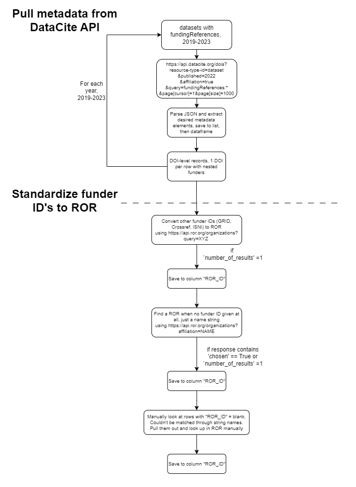
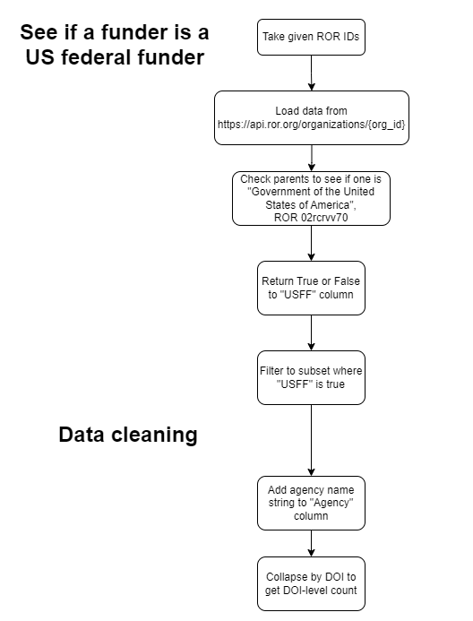
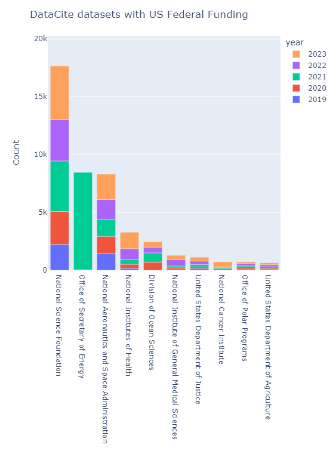

# IOI Reasonable Costs - DataCite Funder Analysis

### Look at the DataCite repository to identify US federally funded datasets

To narrow down to look only at DOIs that have some funder information declared, the API query [https://api.datacite.org/dois?resource-type-id=dataset&query=fundingReferences:*](https://api.datacite.org/dois?resource-type-id=dataset&query=fundingReferences:*) was used. This returned 974,334 results as of March 22, 2024, which represent 5.8% of all datasets or 1.8% of all DOIs.

DataCite records include various funder identification systems (ISNI, GRID, ROR, Crossref funder ID, etc). This analysis chose to standardize on ROR, so any other PID was converted to the equivalent ROR ID. If no funder identifier was provided, a separate API endpoint was used to match the free-text string.

   

Figure 1. Flowchart showing process of pulling DataCite metadata and standardizing on ROR.

Once funders were standardized to a ROR ID, the "parent/child" hierarchy provided by ROR was used to see if there was a path to the US Government. If so, that funder was marked as a US Federal Funder. If not, the code backed up to try a different parent path, if possible.

   

Figure 2. Flowchart showing process to evaluate each funder for USFF.

Results show the EMSL dominates, after that it is...

   

Figure 3. Results excluding the most often found funder, EMSL, with >300k records.

#### Related work: 
Steinhart, G., Schares, E., Skinner, K. (2024, May 30). Navigating the future of data sharing: The impact and cost of expanded public access requirements. _IASSIST/CARTO Conference 2024_, Halifax, Nova Scotia. https://zenodo.org/records/11263223.
